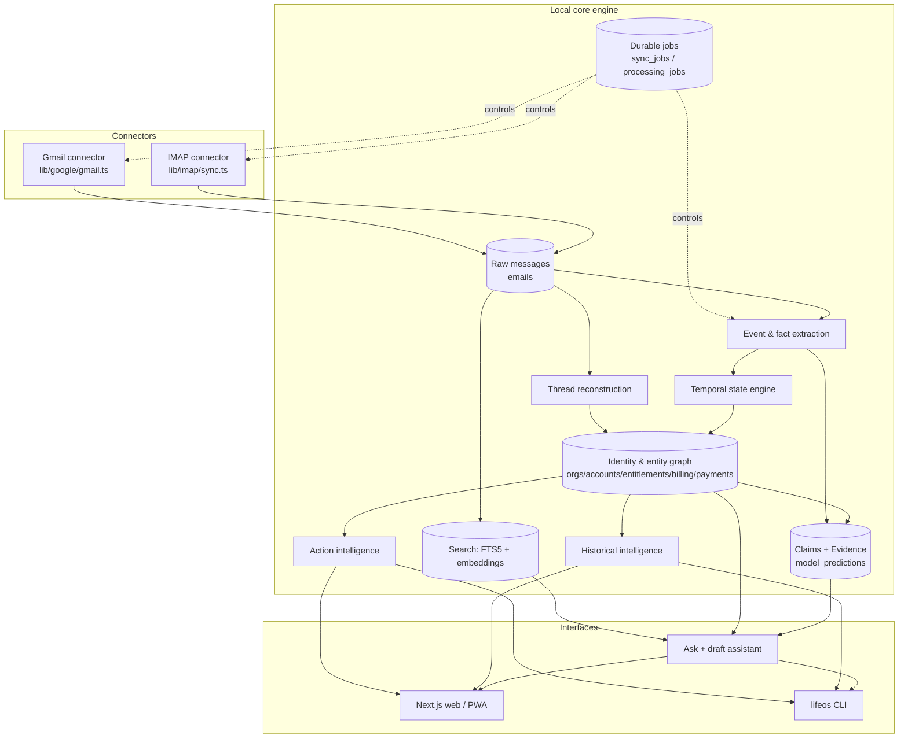
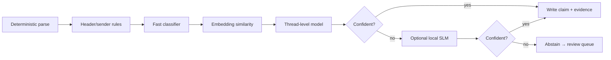
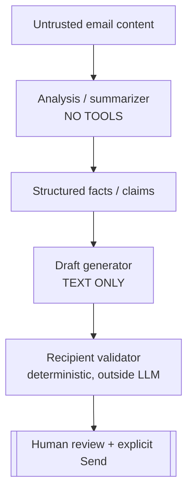

# LifeOS — Architecture

Status: target architecture with current-state annotations. Facts observed in the repo are marked
**[now]**; planned additions are marked **[target]**.

## 1. Component overview

## 2. Data flow (ingest → insight)

1. **Sync [now/target].** Connectors pull message **metadata first** (headers, snippet, labels), keyed
   idempotently. Gmail uses paginated crawl with a crash-safe resume token, then incremental
   `history.list` via `gmail_history_id` (404 → recent-window fallback). IMAP uses UID + UIDVALIDITY
   cursors **[target: verify/ harden]**. Bodies/attachments fetched **selectively** and scope-gated.
2. **Raw store [now].** `emails` holds immutable normalized source records (+ `attachments` JSON,
   labels, headers). Extended **[target]** with `references`, `in_reply_to`, `reply_to`, content hash,
   folder (Inbox/Sent/Drafts/Spam/Trash).
3. **Thread reconstruction [target].** Build `conversations` from Gmail `threadId` + `Message-ID` +
   `References`/`In-Reply-To` + normalized subject + participants + date proximity; spans providers and
   forwards; dedups forwarded/imported copies.
4. **Entity resolution [target].** Map sender domain / merchant descriptor / receipt vendor / product →
   `organizations`; create/keep `service_accounts` conservatively (never company-only).
5. **Event & fact extraction [now→target].** Rules + optional LLM extract structured events (charge,
   failed_charge, trial, cancellation, price_change, password_reset, document_requested, reply_requested,
   …). Today: `email_intelligence` (intent + fields). Target: typed events feeding claims.
6. **Temporal state [target].** Fold events into per-account/entitlement timelines producing states
   (active, expired, cancelled_active_until_end, included, superseded, uncertain).
7. **Claims + evidence [target].** All high-impact conclusions become append-only claims with +/−
   evidence, confidence, model version, validity window.
8. **Search index [now].** FTS5 (`emails_fts`) + embeddings (`email_embeddings`) enable hybrid retrieval.
9. **Action & historical intelligence [target].** Reply-needed, waiting-for, deadlines, focus ranking;
   resolution matching + relevance decay.
10. **Interfaces.** Web/PWA, CLI, and the evidence-based Ask + draft assistant read the graph and index.

## 3. Process boundaries

- **Single local process [now].** Next.js server (Node) with `better-sqlite3` in-process. No external
  services required; cloud AI is an optional outbound call.
- **Jobs [target].** A durable `processing_jobs` table + an in-process runner replaces inline sync in the
  request path for backfill; each job is idempotent, checkpointed, resumable. Not microservices
  (see ADR). Heavy CPU (embeddings) may move to a worker thread **[target]**.
- **Model runtime.** Transformers.js/ONNX embeddings load as a singleton; optional Ollama and optional
  Claude are separate, gated call sites.

## 4. Database domains (one SQLite file, logical grouping)

| Domain | Tables |
| --- | --- |
| Raw source | `emails`, `emails_fts`, `providers`→`mailboxes` |
| Identity | `user_identities`, `email_aliases`, `contacts`, `contact_email_addresses` |
| Org/account/billing | `organizations`, `service_accounts`, `entitlements`, `billing_agreements`, `payment_events`, `communication_relationships` |
| Conversations | `conversations`, `conversation_messages` |
| Action/obligation | `obligations`, `action_items`, `deadlines`, `reply_assessments`, `draft_suggestions`, `historical_findings` |
| Evidence/provenance | `claims`, `evidence`, `model_predictions`, `feedback_events` |
| Derived AI | `email_embeddings`, `email_intelligence`, `email_clusters`, `overview_stats`, `overview_daily` |
| Ops | `sync_runs`, `sync_jobs`, `processing_jobs`, `settings`, `schema_version` |

Raw + identity + evidence are durable; derived AI is rebuildable. See `docs/DATA_MODEL.md`.

## 5. Connector boundaries

- Connectors know only how to **list, fetch, and cursor** a provider. They write raw rows and cursor
  state; they do **not** classify. This keeps sync idempotent and decouples model changes from I/O.
- Per-mailbox **capabilities** (read_metadata/body/attachments, local_ai, cloud_ai, draft, send, labels,
  cross_inbox_match, personalize) gate what a connector and the pipeline may do for that mailbox.

## 6. AI pipeline (cascade)

Details, features, calibration, abstention, and the model registry are in `docs/AI_ML_PLAN.md`.

## 7. Security boundaries

Email content can supply facts but never instructions. The analyzer has no tools; the drafter emits
text; recipients are validated deterministically; sending is a human action. Auth signals
(SPF/DKIM/DMARC, Reply-To/From mismatch, lookalike domains) run **before** reply generation. See
`docs/SECURITY_PRIVACY.md`.

## 8. Deployment

- **Local (default).** `npm run dev`/`start`; SQLite under `data/`. PWA install supported. Optional
  scheduled sync via `app/api/cron/sync`.
- **Optional cloud AI.** Outbound Claude calls, opt-in per mailbox, `content` scope off by default.
- **Desktop [postponed].** Electron recommended (keeps Node + `better-sqlite3`); Tauri would require an
  FFI/sidecar for SQLite. See ADR. **Mobile [postponed]:** PWA → companion → RN, staged.
