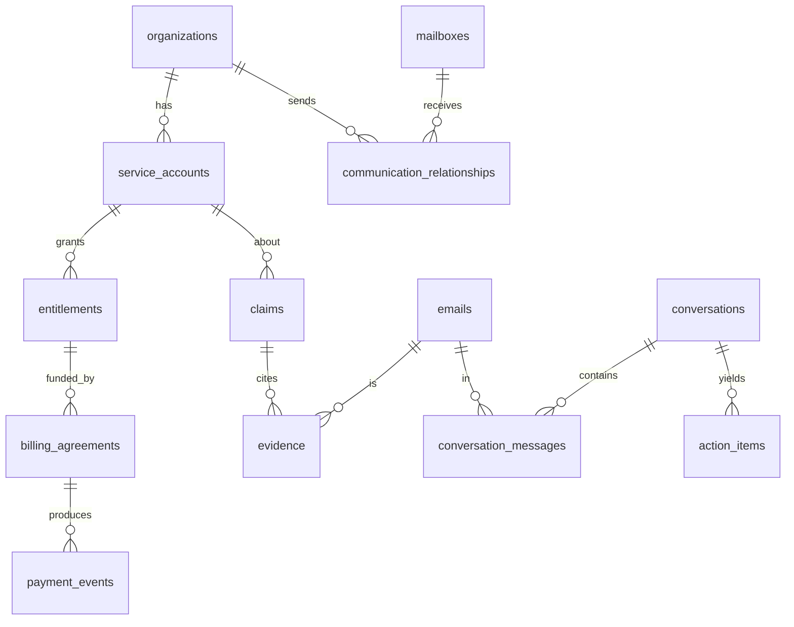

# LifeOS — Data Model

Status: **target** schema with migration from the **current** schema. Conventions: `id TEXT` UUID,
timestamps ISO-8601 `TEXT`, arrays/objects stored as JSON `TEXT`, WAL + `foreign_keys=ON`. All schema
changes go through the versioned migration runner (see `docs/adr/0001-*` and `IMPLEMENTATION_CHECKLIST`).

## 0. Current schema (as built, `lib/db/local.ts`)

- `providers(id, user_id, type, email, username, display_name, host, port, tls, encrypted_password,
  status, last_sync_at, error_message, created_at, history_page_token, history_synced_count,
  history_complete, history_target, gmail_history_id, newest_internal_date)`
- `emails(id, provider_id, uid, gmail_message_id, thread_id, message_id, from_address, to_address,
  subject, date, body_text, snippet, labels JSON, headers JSON, attachments JSON, folder, created_at)`
  — `unique(provider_id, uid)`, `unique(provider_id, gmail_message_id)`
- `subscriptions(id, user_id, provider_id, company, sender_email, sender_domain, category, kind
  {paid|mailing_list}, confidence, source, amount, currency, billing_cycle, due_date, status
  {active|cancelled|unknown|ignored}, email_used, first_seen, last_seen, source_email_id)` —
  **`unique(user_id, provider_id, company)`** ← the conflation to fix
- `accounts(id, user_id, provider_id, company, domain, email, status {active|closed|unknown|ignore},
  confidence, source, first_seen, last_seen, source_email_id)` — **`unique(user_id, provider_id,
  company)`**
- `google_accounts(provider_id PK, google_account_id, email, scope, encrypted_access_token,
  encrypted_refresh_token, expires_at, updated_at)`
- `sync_runs(...)`, `settings(key,value,updated_at)`
- Derived: `email_embeddings`, `email_intelligence`, `email_clusters`, `overview_stats`,
  `overview_daily`, `emails_fts` (FTS5)

**Problem:** `subscriptions` and `accounts` fold *organization*, *service account*, *entitlement*,
*billing*, *payment*, and *mailing-list* into one company-keyed row per provider. Two accounts at one
company, third-party billing, bundles, trials, and "cancelled but active" are all unrepresentable.

## 1. Target entities

### 1.1 Identity

```
mailboxes            id, user_id, provider_id(->providers), address, provider {gmail|imap},
                     purpose {personal|work|study|finance|other}, capabilities JSON
                     { read_metadata, read_body, read_attachments, local_ai, cloud_ai,
                       draft, send, labels, cross_inbox_match, personalize } (least-privilege defaults),
                     created_at
user_identities      id, primary_name, created_at
email_aliases        id, user_identity_id(->user_identities), address, kind {primary|alias|send_as|
                     forward|old}, mailbox_id?, confidence, created_at
contacts             id, canonical_name, organization_id?, created_at
contact_email_addresses  id, contact_id(->contacts), address, first_seen, last_seen
```

`mailboxes` wraps `providers` (kept for connector/token compatibility). `email_aliases` lets LifeOS
know which addresses are *the user* (self) across inboxes without merging contacts by name.

### 1.2 Organization / service account / entitlement / billing / payment

```
organizations        id, name, domains JSON[], aliases JSON[], parent_organization_id?, created_at
service_accounts     id, organization_id(->organizations), login_identity_id(->email_aliases)?,
                     external_account_ref_hash?, status {active|inactive|locked|closed|unknown},
                     first_seen_at, last_seen_at, confidence, merged_from JSON[]?, created_at
entitlements         id, service_account_id(->service_accounts), product_name,
                     status {trial|active|paused|cancelled_active_until_end|expired|included|unknown},
                     valid_from?, valid_until?, renews_automatically?, created_at
billing_agreements   id, entitlement_id?(->entitlements), service_account_id?(->service_accounts),
                     payer_identity_id?(->email_aliases|contacts),
                     channel {direct|apple|google_play|paypal|telecom|employer|family_member|
                              gift_card|bundle|unknown},
                     cycle {weekly|monthly|quarterly|annual|irregular}?, expected_amount?, currency?,
                     status {active|stopped|failed|unknown}, created_at
payment_events       id, billing_agreement_id?(->billing_agreements), type {charge|refund|
                     failed_charge|authorization|credit|chargeback}, amount?, currency?, occurred_at,
                     merchant_descriptor?, evidence_email_id(->emails), created_at
communication_relationships  id, organization_id(->organizations), mailbox_id(->mailboxes),
                     type {newsletter|marketing|transactional|security|support|community},
                     status {active|unsubscribed|unknown}, first_seen, last_seen, created_at
```

Key separations: **access** (entitlement.status) ≠ **payment** (billing_agreement + payment_events) ≠
**auto-renew** (entitlement.renews_automatically) ≠ **mailing** (communication_relationships). An
`entitlement` can be `included` with **no** `billing_agreement`. A `payment_event` may exist before its
`billing_agreement`/account is known (linked later).

### 1.3 Conversations

```
conversations        id, topic, state {needs_my_reply|needs_my_action|waiting_for_them|
                     deadline_upcoming|financial_attention|security_attention|resolved|informational|
                     stale_uncertain}, participant_ids JSON[], mailbox_ids JSON[], first_at, last_at
conversation_messages  conversation_id(->conversations), email_id(->emails), role {incoming|outgoing},
                     PRIMARY KEY(conversation_id, email_id)
```

Cross-provider: a conversation may reference emails from several mailboxes and dedup forwarded copies.

### 1.4 Action / obligation

```
obligations          id, conversation_id?, organization_id?, service_account_id?, kind, title,
                     status {open|waiting|completed|dismissed|expired|uncertain},
                     detected_at, resolved_at?, created_at
action_items         id, obligation_id?(->obligations), conversation_id?, mailbox_id?, type, title,
                     status {open|waiting|completed|dismissed|expired|uncertain}, urgency, importance,
                     deadline?, confidence, detected_at, resolved_at?, created_at
deadlines            id, action_item_id?/obligation_id?, due_at, source_email_id(->emails), confidence
reply_assessments    id, conversation_id(->conversations), reply_expected {required|recommended|
                     action_no_reply|optional_ack|none|uncertain}, request_type, requested_info JSON[],
                     requested_actions JSON[], deadline?, already_answered {0|1}, confidence, model_version
draft_suggestions    id, conversation_id, from_mailbox_id, to JSON[], cc JSON[], subject, body,
                     rationale, needs_facts JSON[], status {suggested|edited|created_draft|discarded},
                     gmail_draft_id?, created_at
historical_findings  id, subject_type, subject_id, status {open_and_relevant|resolved_directly|
                     resolved_indirectly|expired|superseded|probably_irrelevant|uncertain},
                     relevance, reason, created_at
```

### 1.5 Evidence & provenance (the trust layer)

```
claims               id, subject_type {service_account|entitlement|billing_agreement|obligation|
                     conversation|communication_relationship}, subject_id, predicate {account_active|
                     membership_active|auto_renews|user_is_payer|payment_failed|mailing_list_active|
                     reply_needed|resolved|...}, value (json/bool/num/str), valid_from?, valid_until?,
                     confidence, model_version, created_at, superseded_by?
evidence             id, claim_id(->claims), email_id(->emails), polarity {+1|-1}, weight,
                     snippet_ref?, note?, created_at
model_predictions    id, subject_type, subject_id, model, feature_version, output JSON, confidence,
                     reasons JSON[], input_scope {metadata|content}, created_at   -- APPEND-ONLY
feedback_events      id, subject_type, subject_id, kind {explicit_correction|confirm|independent_reply|
                     archive|ai_auto}, trust {very_strong|strong|medium|weak|none}, value JSON,
                     created_at
```

Rules: `claims` are **append-only**; a newer claim `supersedes` an older one rather than editing it.
`evidence` records **both** supporting (+1) and contradicting (−1) messages. `model_predictions` are
never overwritten, enabling "v1 said paid, v2 says inactive" and selective reprocessing by version.
`feedback_events.trust` down-weights AI-caused actions to avoid feedback loops.

### 1.6 Jobs & meta

```
schema_version       version INTEGER (single row)
sync_jobs            id, mailbox_id, kind {backfill|delta|recent}, status, cursor JSON, progress JSON,
                     started_at, updated_at, error?
processing_jobs      id, kind {parse|resolve_thread|resolve_entities|extract_events|classify|
                     update_graph|update_actions|summarize}, subject_id, status, checkpoint JSON,
                     model_version, started_at, updated_at, error?
```

### 1.7 Raw layer extensions

Add to `emails`: `references TEXT`, `in_reply_to TEXT`, `content_hash TEXT`; use `folder` for
Inbox/Sent/Drafts/Spam/Trash; keep `attachments` JSON as `[{filename, mime, size, hash}]`. `reply_to`
is already fetched into `headers`; promote to a column for indexing.

## 2. Relationships (summary)



## 3. Constraints, uniqueness, indexes

- **No company/domain unique key on accounts.** `service_accounts` uniqueness is by resolved identity
  (login alias / external_account_ref_hash / explicit merge), never by `organization_id` alone.
- `payment_events`: index `(billing_agreement_id, occurred_at)`, `(merchant_descriptor)`.
- `claims`: index `(subject_type, subject_id, predicate, created_at)`; partial index where
  `superseded_by IS NULL` for "current best".
- `evidence`: index `(claim_id)`, `(email_id)`.
- `conversation_messages`: index `(email_id)` for reverse lookup.
- `communication_relationships`: unique `(organization_id, mailbox_id, type)`.
- Keep existing `emails` indexes; add `(thread_id)`, `(message_id)`, `(content_hash)`.

## 4. Temporal modelling

State is **derived by folding events over time**, not stored as a single mutable label:
`entitlement.status` at time *t* = reduce(events ≤ *t*). Persist the current fold for fast reads, but the
authoritative history is `payment_events` + event-type claims + their validity windows. This yields
timelines like:

```
Account A: 2023-05 created → 2023-05 trial → 2023-06 trial_cancelled → 2023-06 expired
           → 2024-01 newsletter (communication_relationship, NOT entitlement) → 2026-08 dormant
Account B: 2025-02 created → 2025-02 active(Premium) → 2026-07 charge(Apple) → 2026-08 active
```

## 5. Migration from current schema

1. **Add `schema_version`** + runner; back up `data/lifeos.sqlite` before applying (ADR 0001).
2. **Extend `emails`** with `references`, `in_reply_to`, `reply_to`, `content_hash` (idempotent
   `ensureColumns`).
3. **Create `mailboxes`** wrapping each `providers` row 1:1 with least-privilege capabilities.
4. **Create entity/evidence/job tables** (no behavior).
5. **Backfill job** (idempotent, resumable): for each `subscriptions`/`accounts` row →
   - upsert `organizations` (by normalized domain/name);
   - create/find a `service_account` **per (organization, distinguishing evidence)** — do **not** collapse
     distinct `email_used`/`provider` accounts into one;
   - `subscriptions.kind='paid'` → `entitlement` (+ `billing_agreement` if amount/cycle present) with a
     seed `claim` (`membership_active`) citing `source_email_id`;
   - `subscriptions.kind='mailing_list'` → `communication_relationship`, **not** an entitlement;
   - `accounts` → `service_account` + `account_active` claim citing evidence.
6. **Keep `subscriptions`/`accounts` as back-compat** (read paths fall back to them) until the graph UI
   ships and is verified; then mark deprecated.

Migrations are reversible-or-recoverable: each has a documented rollback (restore backup) and derived
data can be rebuilt from raw.

## 6. Worked example — two Netflix accounts

Input evidence (emails):
- `E1` 2024-01, to `old@gmail.com`, from `info@netflix.com`, "Welcome to Netflix".
- `E2` 2024-03, to `old@gmail.com`, from `info@netflix.com`, "Your membership has ended".
- `E3` 2026-02, to `old@gmail.com`, from `news@netflix.com`, "New this week" (List-Unsubscribe).
- `E4` 2026-07, to `me@gmail.com`, from `no_reply@apple.com`, "Your receipt from Apple — Netflix
  Premium 199 NOK".

Resolved graph:
```
organizations: { Netflix (domains:[netflix.com]) }, { Apple (domains:[apple.com]) }
service_accounts:
  SA-A (org=Netflix, login=old@gmail.com, status=inactive)
  SA-B (org=Netflix, login=me@gmail.com,  status=active)      # NOT merged with SA-A
entitlements:
  ENT-A (SA-A, Netflix, status=expired, valid_until=2024-03)
  ENT-B (SA-B, Netflix Premium, status=active)
billing_agreements:
  BA-B (ENT-B, channel=apple, payer_identity=me@gmail.com's Apple ID, cycle=monthly,
        expected_amount=199, currency=NOK, status=active)
payment_events:
  PE-B (BA-B, type=charge, amount=199, currency=NOK, occurred_at=2026-07, evidence=E4)
communication_relationships:
  CR-A (org=Netflix, mailbox=old@gmail.com, type=newsletter, status=active)   # from E3
claims (append-only, with evidence):
  membership_active(SA-A)=false  [+E2]  [−nothing]  conf .8
  account_active(SA-A)=true      [+E1]                conf .7   (account exists; inactive membership)
  membership_active(SA-B)=true   [+E4]                conf .85
  user_is_payer(SA-B)=via Apple  [+E4]                conf .8
  mailing_list_active(org=Netflix, old@gmail.com)=true [+E3]    conf .9
```

Guarantees the model must uphold: **E3 (newsletter) does not create/keep an entitlement**; **E4's Apple
receipt attaches billing to SA-B, not to Apple-as-subscription**; **SA-A and SA-B stay separate** despite
sharing organization Netflix; "no recent receipt for SA-A" is recorded as absence, **not** as a
cancellation claim. This is the acceptance test for the entity-graph phase.
